現在簡単にデプロイするためのサービスがたくさん存在します。

その中でも有名なのが Netlify というサービスです。

こちら Nike などが自分たちのサイトをデプロイするのに使っているプラットフォームで多くの会社から信頼を得ているので使っていきたいと思います

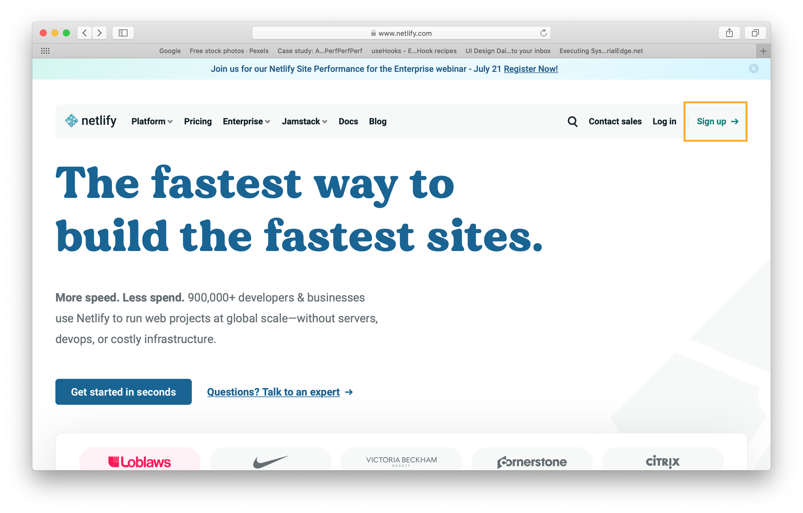

まずはアカウントを作成します

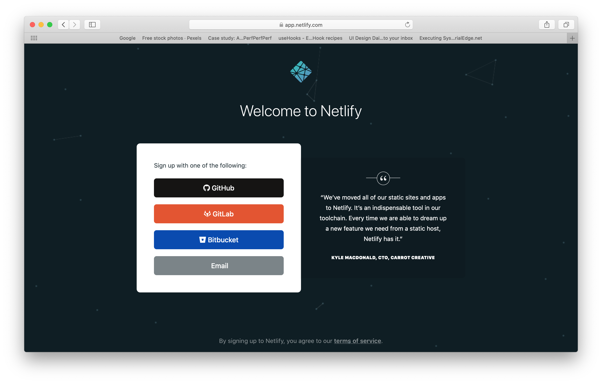

Github と連携すると今後レポジトリに push した際に自動的にデプロイをするように設定していくことも可能です。今回は github でアカウントを作成していきます

Gihub にアクセスする権限を与えるか確認する画面が表示されるので緑のボタンを押して承認しましょう

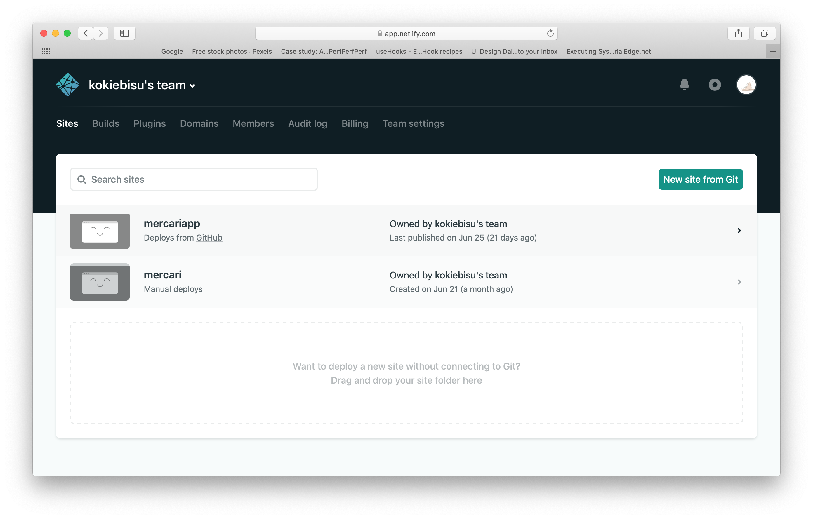

成功すればこのようなダッシュボードが表示されます

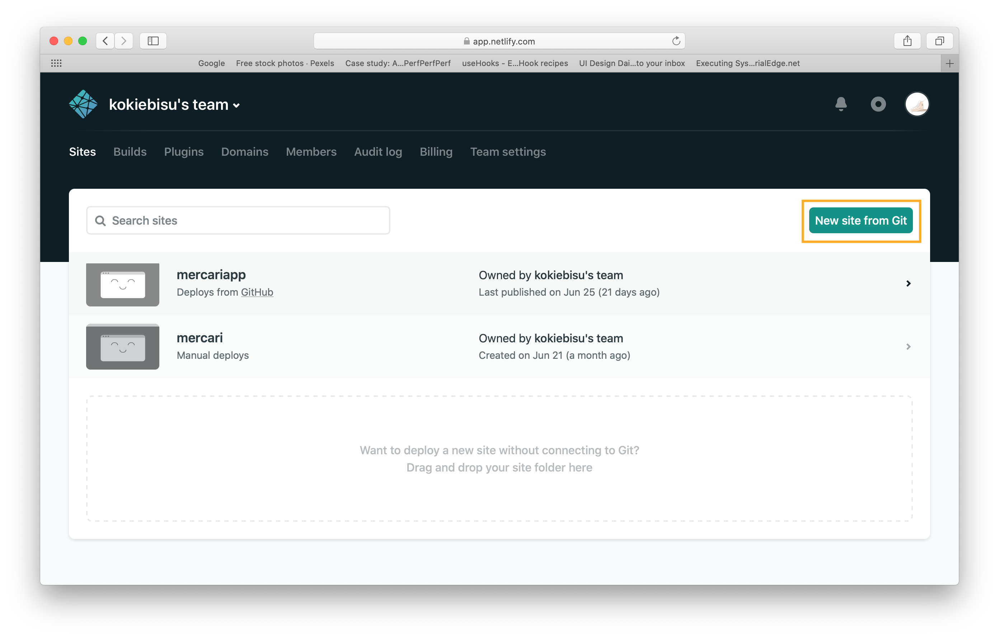

サイトをでデプロイしていきます

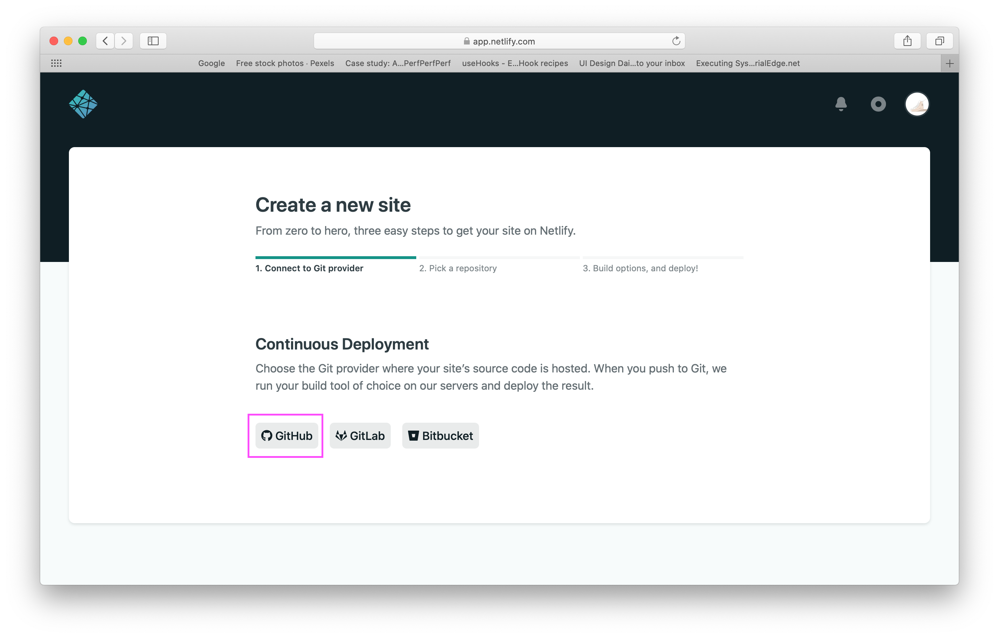

今回であれば Github のレポジトリにあるコードをデプロイしていくので Github を選びます

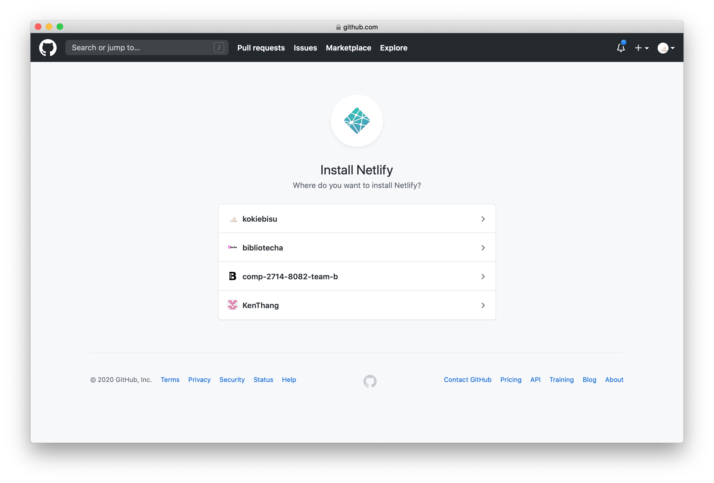

Github にはさまざまな便利なプラグインが存在していて Netlify のプラグインをインストールすることにより先ほど話したように自動的にデプロイをしてくれるので自分のアカウントを選びましょう

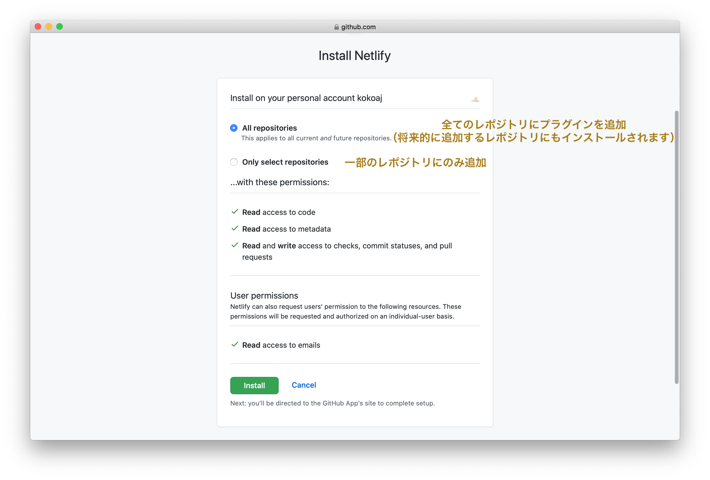

インストールボタンをクリック

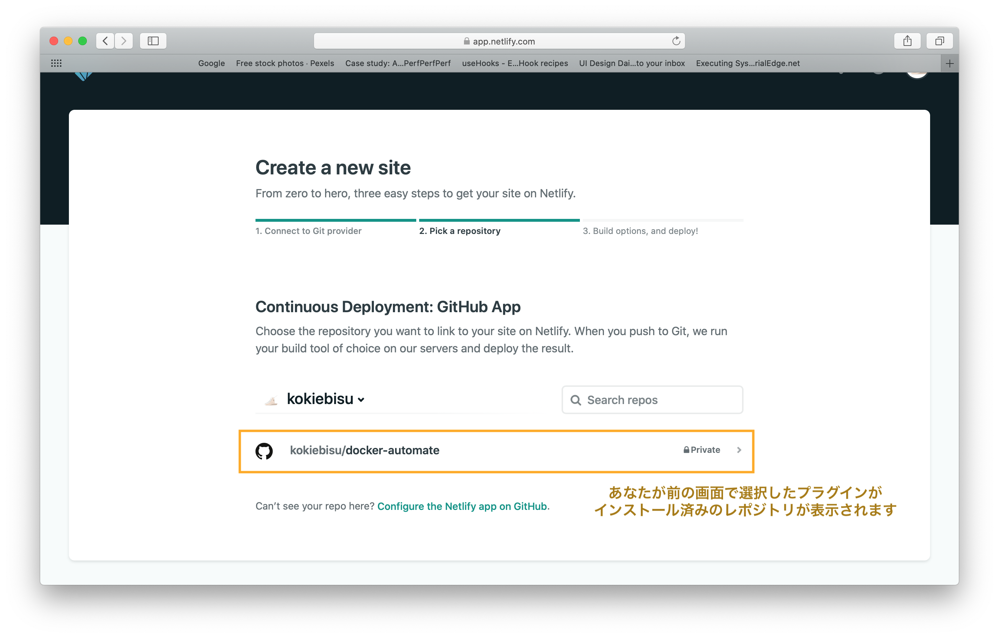

デプロイしたいレポジトリを選択します

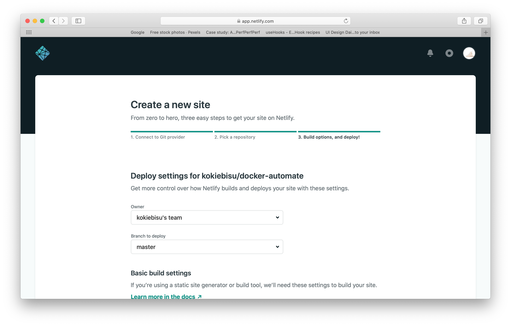

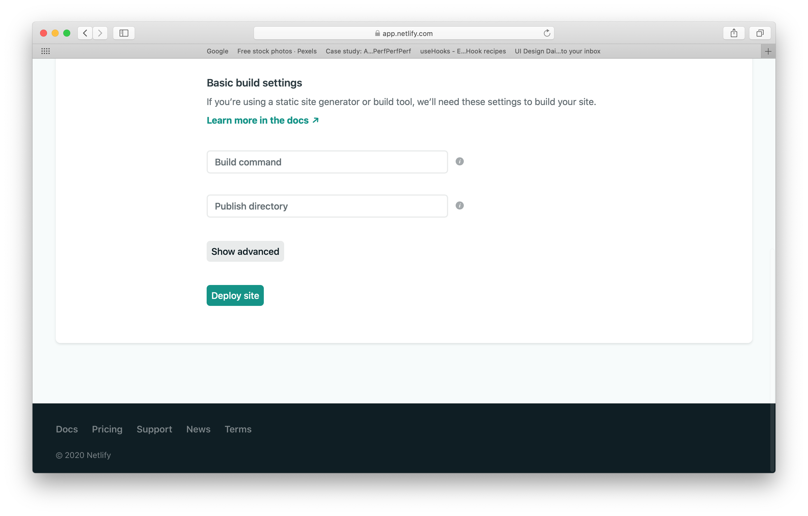

## Build command

React などの Javascript ライブラリを使っていくと必ず build というコマンドが内包されています。（package.json で確認できます）

この build というコマンドはサイトを構築する上で必要なファイルをコンパクトにまとめてくれる便利なコマンドです

今回は build するためのコマンドをここに書きます

（react に移行した際より詳しく解説していきます）

React など Javascript のライブラリを使っていなければ空欄で大丈夫です

## Publish c

デプロイするためにはこのサイトに index.html がどこにあるのかを認識させる必要があります

レポジトリのフォルダの中で index.html がどこにあるのか指定してあげましょう

もしフォルダを開けてすぐのところにあれば空欄のままで大丈夫です

緑のボタンをワンクリックで自動的にデプロイをしてくれます

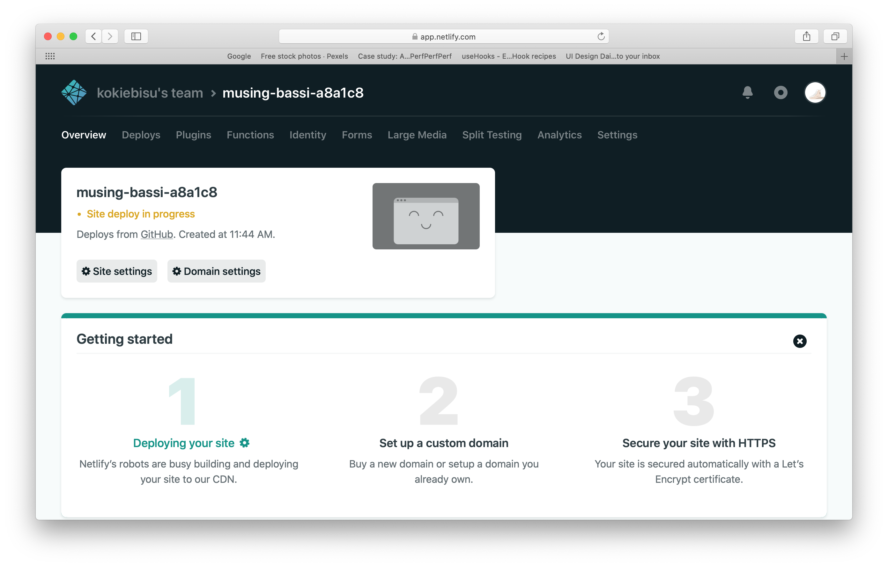

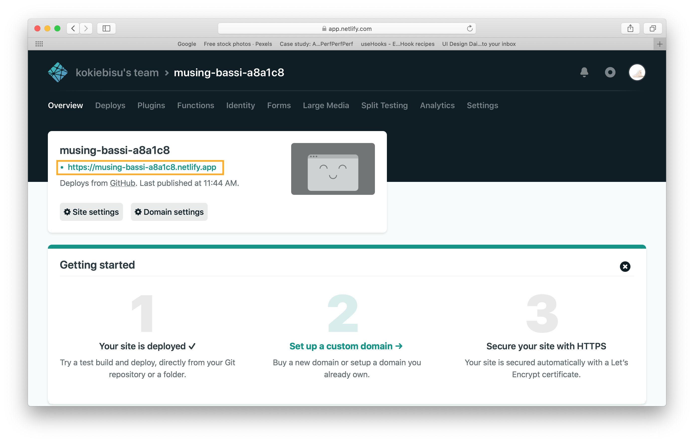

デプロイし終わると URL が掲載されるので URL をクリックして確認してみましょう

# もしうまくいかなかったら？

ここでデバッグと呼ばれる作業に入っていきます。

デバッグとはつまり**どのコードが原因でうまく機能していないのかを見つけることです**

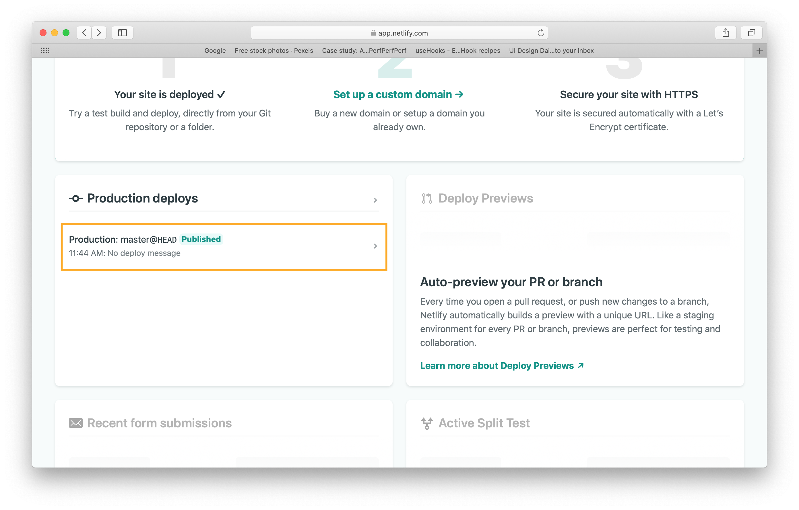

少しスクロールしていただくと Production deploys というセクションがありますのでその中の一番上のものをクリックしましょう

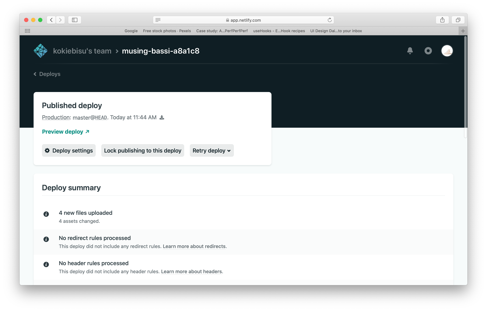

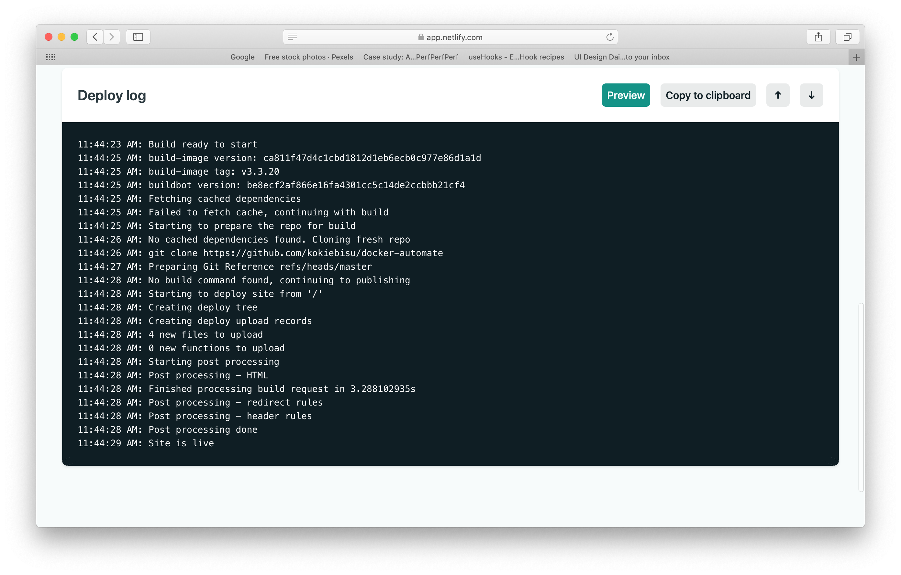

するとログと呼ばれるデプロイの工程を全てもじに起こして表示してくれます。ここからエラーを探していきます。

赤文字でログに表記されている部分があれば注目しましょう。構文などの間違いを指摘してくれています
