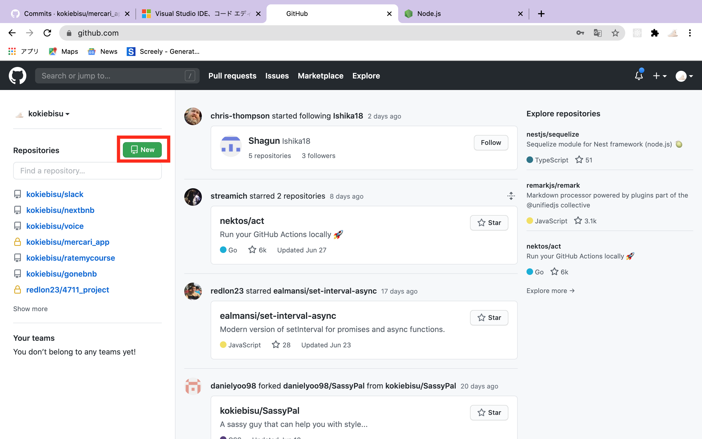
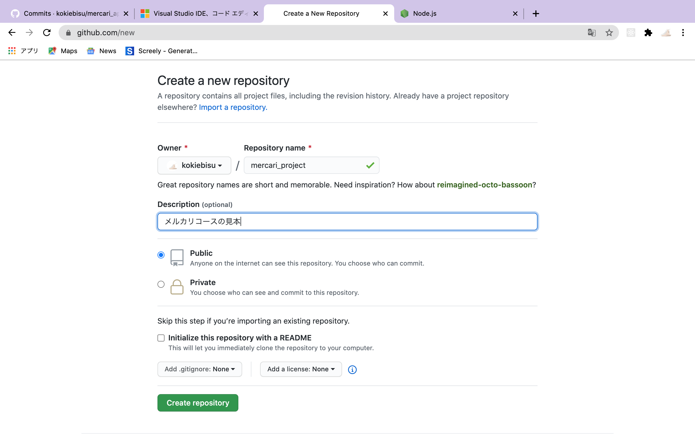
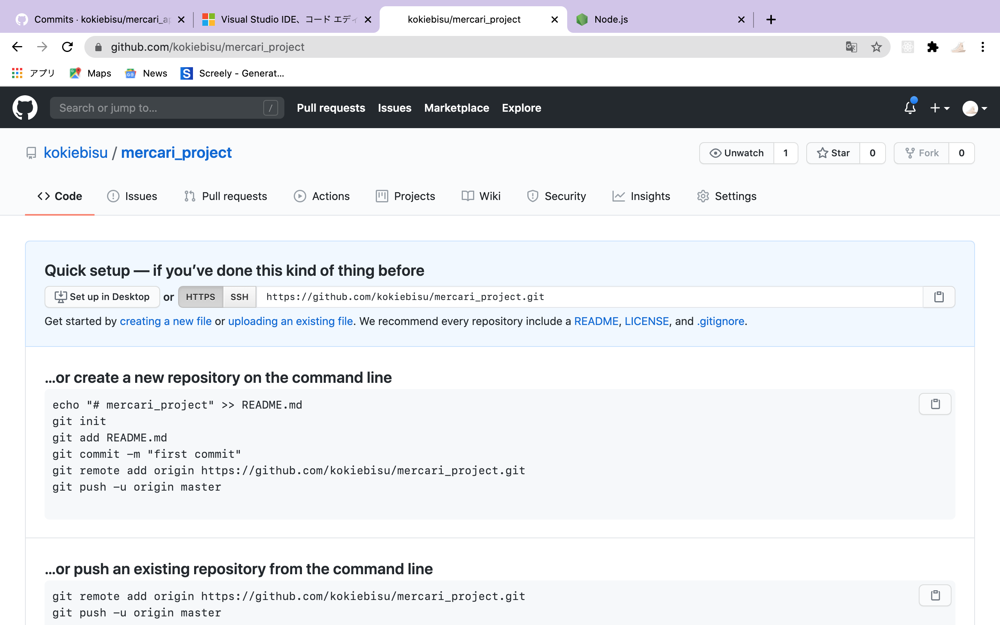

### Github とは

> 共同で開発していく上でコードを管理するためのツール

### 例え

あなたはチーム共同のプロジェクトに参加しています。コードを配られてそれぞれでコードを進めるように頼まれました。あなたはコードを自分のパソコンに保存し書いていきました。しかし次のミーティングに出ると全員が違うコードを持ってきてしまい、一つのプロジェクトとして統一できなくなってしまいました。

->　これをなくすために作られたのが Github です！

#### アカウントを作成しましょう

Github と検索して一番上のリンクをクリック

 

 

 

情報を入力してサインアップしましょう

#### レポジトリを作ってみましょう

 

 

アカウントが作れればこのような画面が表示されます。

レポジトリとは？　プロジェクトの保管庫のようなもの
プロジェクトをつくる＝レポジトリを着くと思っておけばいいです

 

 

公開するかしないか

しない場合->会社からフリーランスとして委託された
する場合->世界中の人たちと共同でプロジェクトを作りたい時、いろんな人に自分のプロジェクトをみてもらいたい時（コードも含めて）

ポートフォリオを作るなら公開しましょう！

プロジェクト作成後も全ての項目の変更は可能です

 

 

緑のボタンを押すとプロジェクト作成完了です

 

