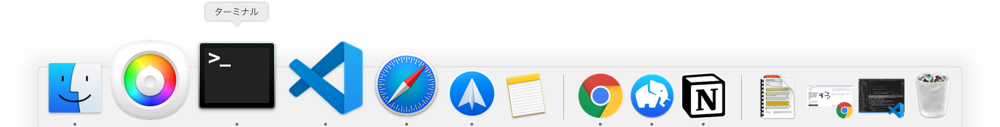
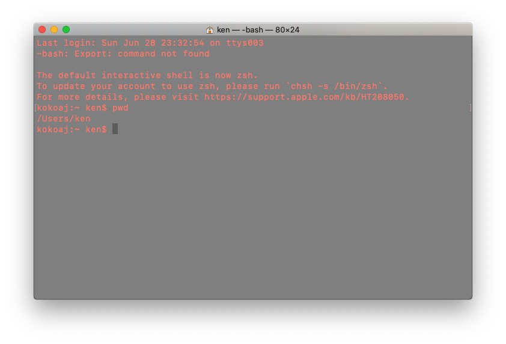
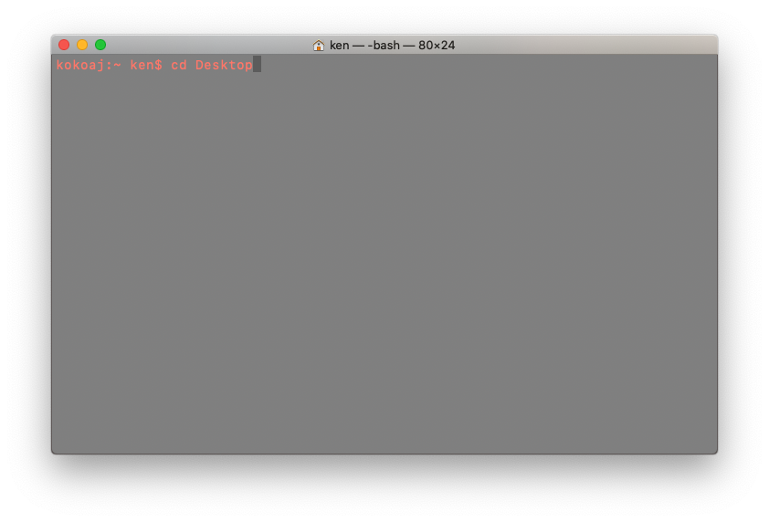
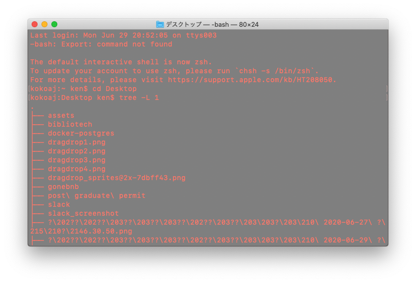

### はじめに

ターミナルではコマンドを送った際に何も起こらず次の行に移動すればコマンドは問題なく処理されてという意味になります。

通常だと右クリックでフォルダを作りますがここではあえてターミナルを使い作ってみましょう

<br />



<br />

ターミナル内で自分が現在どこにいるのか確認しましょう

```bash
pwd
```

<br />



<br />

~ → /Users/＜貴方のユーザー名＞

次はデスクトップにフォルダを作りましょう



```bash
cd Desktop
```

### cd (移動したいフォルダ名)

こちらは change directory の略称です

#### directory とは？

フォルダの別名です

change -> 変える
directory -> フォルダ

注意点！実際にその階層にあるフォルダにしか移動できません！

### 階層とは？

フォルダをうまくまとめるためにコンピュータは階層構造をとっています



### 今いる階層に何があるのか確認する方法

```bash
ls
```

List の略
その階層にある directory(フォルダ）やファイルを表示してくれます
