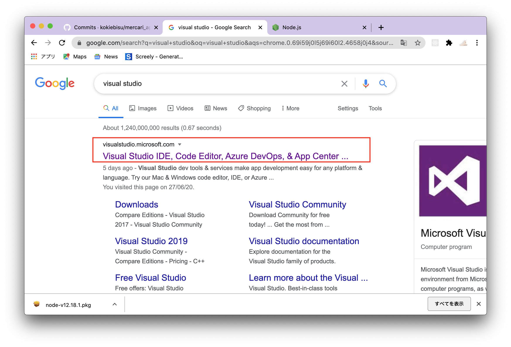
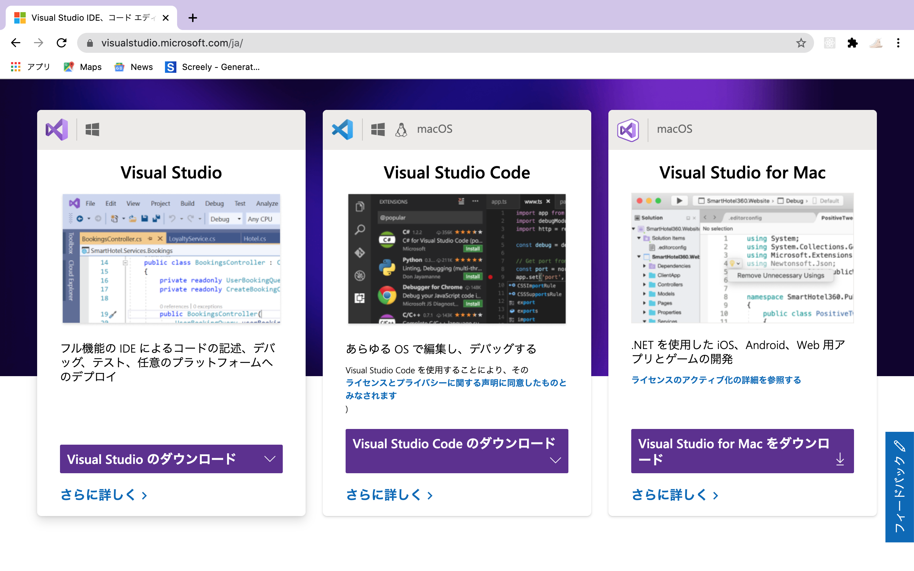
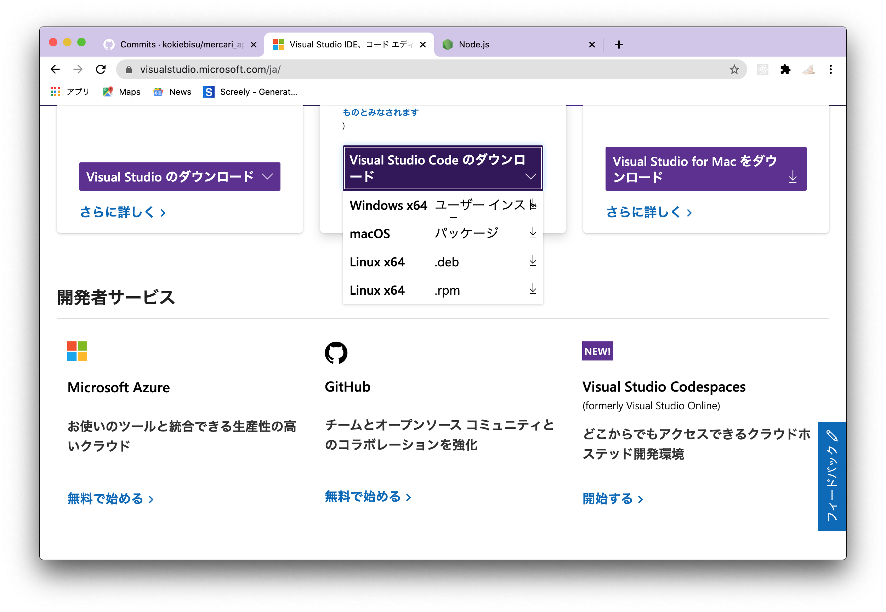
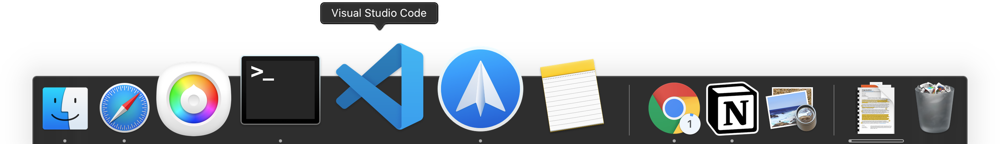

### Visual Studio とは？

> コードを読みやすく、また書きやすく工夫されたメモ帳のようなもの

### インストール方法

 

Visual Studio Code と検索 一番上のリンクをクリックしましょう

 
 

 
 

Visual Studio には３種類ありますがここでは真ん中の物を選びましょう。 ダウンロードボタンにマウスを載せたらこのように出てきます

 
 

 
 

自分の使っているパソコンの OS を選びましょう ダウンロードが完了したダブルクリックして手順を進めていきましょう
成功すれば下記のようにでウクトップアプリとして開けるようになります

