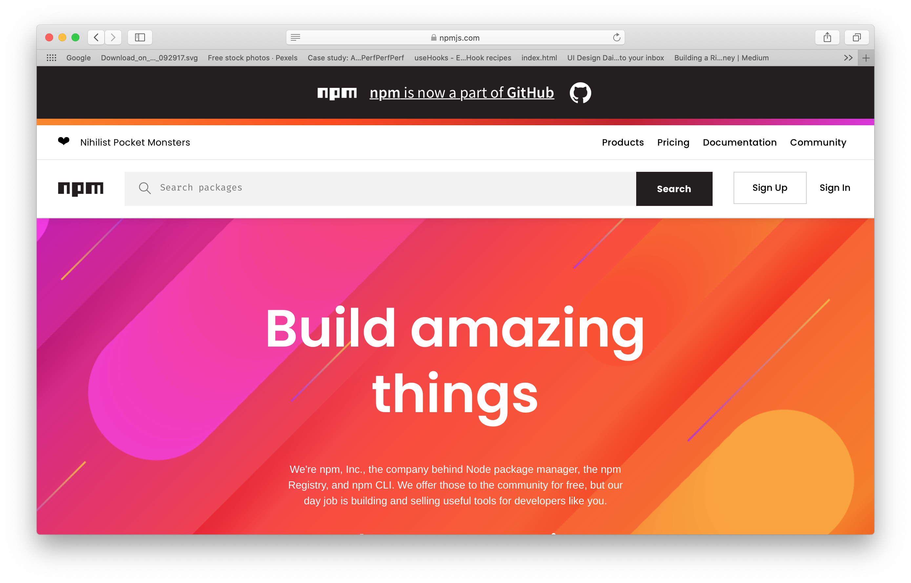
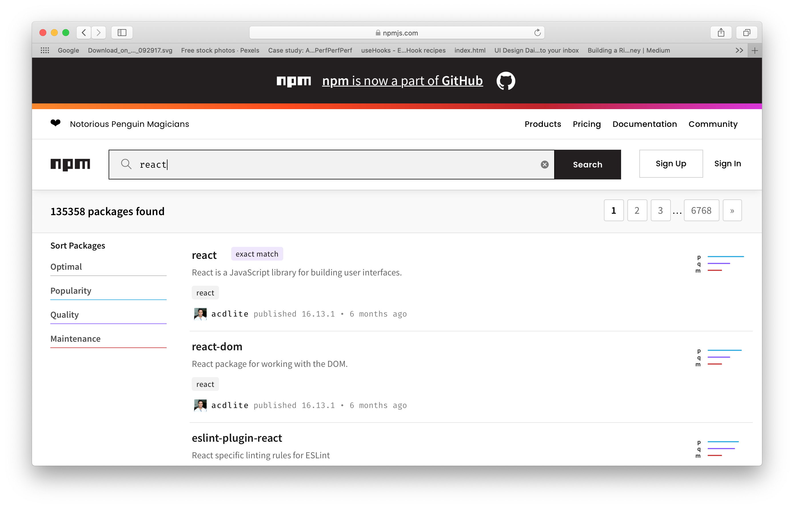
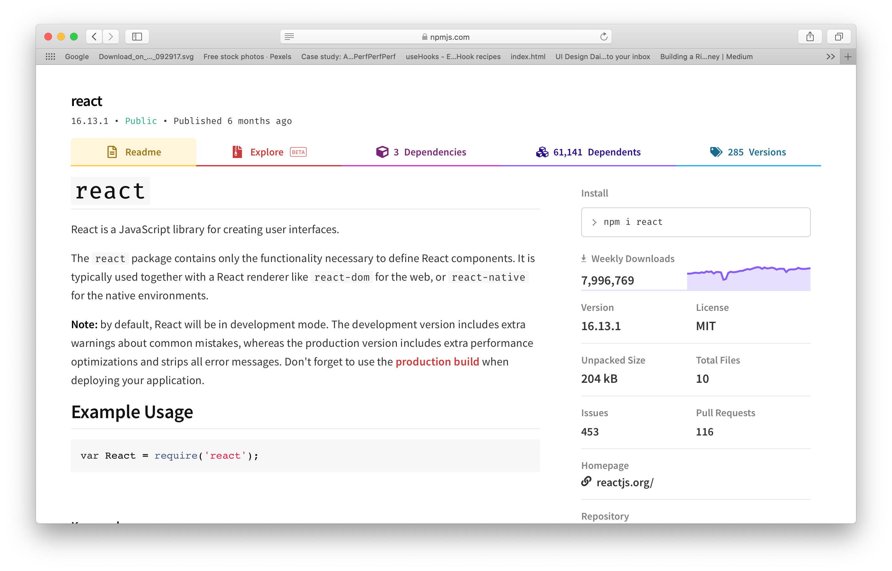

> 外部パッケージは基本的に npm という場所で管理されている

[https://www.npmjs.com](https://www.npmjs.com/)

### 実は React もパッケージの一つなんです！

使い方などが英語ですが表記されています。そのモジュールの人気（信頼できるか）なども書かれているので、今後開発で新しくパッケージを導入する際にはあらゆる側面を考慮した上で導入していきましょう！
