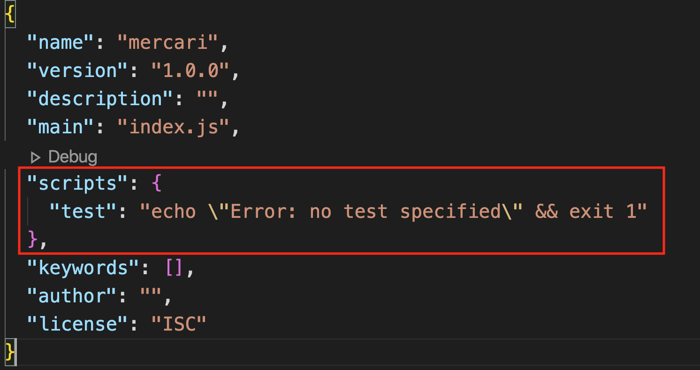

nodejsで開発していくに当たって必ず必要になってくるのがpackage.jsonというファイルです。package

という名前の通り**、自分が使っているパッケージなどをまとめるための設定ファイルのようなものです。**

## なぜそのようなものが必要なのか？

自分だけが進める開発であれば問題ありませんが（それでも、いずれ把握するには限界がくる）、チームで開発していくに当たっていちいち口頭でどのパッケージがインストールされているか共有をすると作業効率は落ちてしまいます。そこで一目でプロジェクトに必要なものがわかるように全て一箇所にまとまっているファイルが用意されています。

## パッケージ名だけか？

パッケージのバージョンも記載されています。パッケージのバージョンはとても大事になってきます。なぜならバージョンが一つ違うだけ使われているコードが劇的に変更される場合があるからです。

## 例

自分のプロジェクトは全てReactのバージョン１を使っているとします。そこでパッケージAがあったとして、そちらのパッケージのアップデートがきていたと仮定しましょう。もしパッケージAが新しいReactのバージョンのコードを使っていて古いバージョンとの互換性がなかったとしましょう。そうするとアップデートした瞬間から今までのコードが一切機能しなくなる場合が出てきます。

パッケージの名前とバージョンをうまくチームで把握することによって、互換性により生じるバグを極力減らしていくことができます。

## タスクランナー

